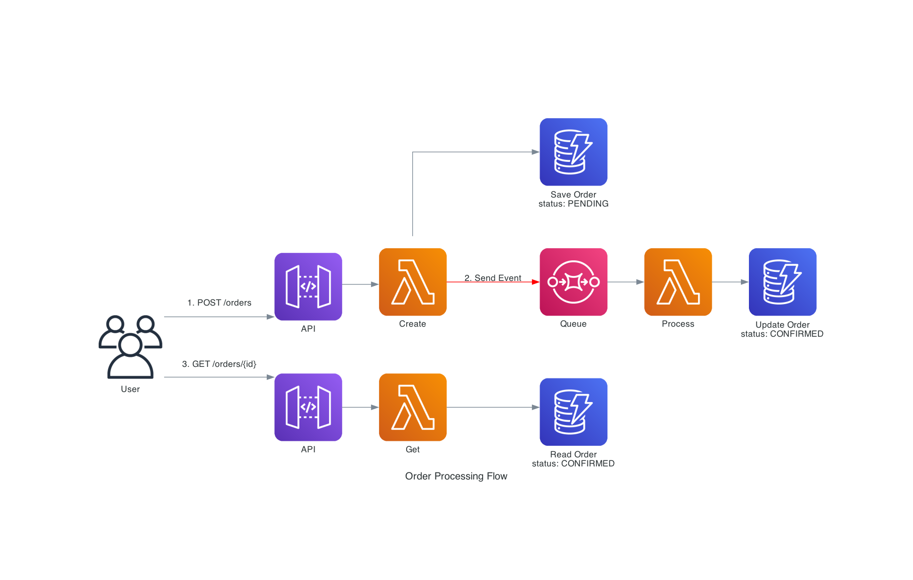

# 🚀 Serverless Order Management System

A **modern, production-ready** serverless application built with the latest AWS services and Node.js 22, demonstrating enterprise-grade serverless development patterns.

> **🆕 2025 Edition**: Node.js 22, AWS SDK v3, ES Modules, DynamoDB GSI, monitoring, and CI/CD pipeline!

---

## 📋 Table of Contents

- [🎯 What You'll Learn](#-what-youll-learn)
- [🏗️ Architecture Overview](#️-architecture-overview)
- [📁 Project Structure](#-project-structure)
- [🔧 Prerequisites](#-prerequisites)
- [⚡ Quick Start](#-quick-start)
- [🧪 Testing the Service](#-testing-the-service)
- [📊 Advanced Features](#-advanced-features)
- [🎨 Demo Scenarios](#-demo-scenarios)
- [📈 Monitoring & Observability](#-monitoring--observability)
- [🚀 CI/CD Pipeline](#-cicd-pipeline)
- [🛠️ Troubleshooting](#️-troubleshooting)
- [🧹 Cleanup](#-cleanup)
- [🆕 What's New in 2025](#-whats-new-in-2025)
- [🏗️ Architecture Documentation](#️-architecture-documentation)
- [📖 Additional Resources](#-additional-resources)

---

## 🎯 What This Demonstrates

This application showcases:

### 🎓 **Core Serverless Concepts**
- **Functions as a Service (FaaS)** - Stateless compute execution
- **Event-driven Architecture** - Loose coupling via events
- **Auto-scaling** - Zero to thousands of concurrent executions
- **Pay-per-execution** - No idle time charges

### ⚡ **Modern AWS Stack (2025)**
- **AWS Lambda** - Node.js 22.x runtime with ES modules
- **API Gateway HTTP API** - Cost-effective HTTP endpoints
- **DynamoDB** - NoSQL database with Global Secondary Indexes
- **SQS** - Message queuing with Dead Letter Queues
- **CloudWatch** - Monitoring, logging, and alerting

### 🏗️ **Production Patterns**
- **AWS SDK v3** - Modular, TypeScript-ready client libraries
- **Infrastructure as Code** - SAM templates with parameters
- **Multi-environment deployment** - Dev, staging, production
- **CI/CD pipeline** - GitHub Actions automation
- **Monitoring & Alerting** - CloudWatch alarms and dashboards

---

## 🏗️ Architecture Overview

Our **modern Order Management Service** demonstrates enterprise serverless patterns:

> 📊 **Visual Diagrams**: See [Architecture Documentation](#️-architecture-documentation) for detailed visual diagrams of system architecture, data flow, cost optimization, and monitoring.

```
                           🌐 INTERNET
                               │
                               ▼
┌─────────────────────────────────────────────────────────────────┐
│                        🔒 API Gateway HTTP API                  │
│                    • CORS enabled • Request validation          │
│                    • Throttling • Caching                       │
└─────────────────────────────────────────────────────────────────┘
           │                    │                    │
           ▼                    ▼                    ▼
┌─────────────────┐  ┌─────────────────┐  ┌─────────────────┐
│ 📝 Create Order │  │ 📋 List Orders  │  │ 🔍 Get Order    │
│ Lambda Function │  │ Lambda Function │  │ Lambda Function │
│ • Node.js 22.x  │  │ • Uses GSI      │  │ • Validation    │
│ • ES Modules    │  │ • Pagination    │  │ • Error Handle  │
│ • AWS SDK v3    │  │ • Filtering     │  │ • Logging       │
└─────────────────┘  └─────────────────┘  └─────────────────┘
           │                    │                    │
           ▼                    ▼                    ▼
┌─────────────────────────────────────────────────────────────────┐
│                        🗄️  DynamoDB Table                      │
│                    • Encryption at rest                         │
│                    • Global Secondary Index (Status)            │
│                    • Point-in-time recovery (Prod)              │
└─────────────────────────────────────────────────────────────────┘
           │
           ▼
┌─────────────────────────────────────────────────────────────────┐
│                        📨 SQS Queue                            │
│                    • KMS encryption                             │
│                    • Dead Letter Queue                          │
│                    • Long polling                               │
└─────────────────────────────────────────────────────────────────┘
           │
           ▼
┌─────────────────┐
│ ⚙️  Order       │
│ Processor       │
│ Lambda Function │
│ • Batch process │
│ • Error handling│
│ • Status updates│
└─────────────────┘
           │
           ▼
┌─────────────────────────────────────────────────────────────────┐
│                     📊 CloudWatch Monitoring                   │
│                 • Lambda metrics • Error alarms                │
│                 • DLQ monitoring • Custom dashboards           │
└─────────────────────────────────────────────────────────────────┘
```

### 🧩 Components Explained

1. **API Gateway**: Serves as the front door for HTTP requests
2. **Lambda Functions**: Stateless compute units that handle business logic
3. **DynamoDB**: NoSQL database for storing order data
4. **SQS**: Message queue for asynchronous order processing
5. **CloudWatch**: Monitoring and logging for observability

### 🔍 **Deep Dive Architecture Diagrams**

See **[📊 Complete Architecture Guide](docs/ARCHITECTURE.md)** for detailed technical diagrams including:

- **Lambda Invocation Flow** - Step-by-step sequence diagram showing:
  - Cold start vs warm start processes
  - Internal AWS services (Invoke Service, Assignment Service, Fleet Management)
  - Firecracker microVM lifecycle
  - Telemetry and error handling flows

- **Lambda Architecture Overview** - High-level architecture showing:
  - All 200+ event sources that can trigger Lambda
  - Control plane vs data plane separation
  - Performance optimization strategies
  - Security and monitoring patterns

These diagrams provide **production-level insights** for understanding serverless architecture at scale.

---

## 📁 Project Structure

```
serverless-demo/
├── 📄 README.md                    # This comprehensive guide
├── ⚙️ template.yaml                # SAM Infrastructure as Code
├── 📦 package.json                 # Node.js dependencies & scripts
├── 🔧 samconfig.toml               # Multi-environment SAM config
├── 📋 eslint.config.js             # Modern JavaScript linting (ESLint v9)
├── 🚫 .gitignore                   # Git ignore patterns
├── 📜 LICENSE                      # MIT license
│
├── 📁 src/handlers/                # Lambda function source code
│   ├── 🔧 httpCreateOrder.mjs      # POST /orders (ES module)
│   ├── 📋 httpListOrders.mjs       # GET /orders (with GSI)
│   ├── 🔍 httpGetOrder.mjs         # GET /orders/{id}
│   └── ⚙️ orderProcessor.mjs       # SQS message processor
│
├── 📁 scripts/                     # Automation scripts
│   ├── 🚀 deploy.sh                # One-click deployment
│   ├── 🧪 demo.sh                  # Interactive testing
│   ├── 📊 load-test.sh             # Auto-scaling demo
│   └── 🧹 cleanup.sh               # Resource cleanup
│
├── 📁 docs/                        # Documentation
│   ├── 🏛️ ARCHITECTURE.md          # Complete architecture + Lambda diagrams
│   └── 🔧 TROUBLESHOOTING.md       # Common issues & solutions
│
├── 📁 .github/workflows/           # CI/CD Pipeline
│   └── 🔄 deploy.yml               # GitHub Actions automation
│
├── 📁 postman/                     # API Testing Collection
│   ├── 🧪 Serverless-Order-Management.postman_collection.json
│   ├── 🌍 Serverless-Demo.postman_environment.json
│   └── 📋 README.md                # Postman setup guide
│
```

### 🔑 Key Files Explained

| File | Purpose | Technology |
|------|---------|------------|
| `template.yaml` | Infrastructure definition | AWS SAM |
| `src/handlers/*.mjs` | Lambda functions | Node.js 22 + ES Modules |
| `package.json` | Dependencies & scripts | npm + AWS SDK v3 |
| `samconfig.toml` | Environment configs | SAM CLI |
| `scripts/*.sh` | Automation utilities | Bash |
| `eslint.config.js` | Code linting configuration | ESLint v9 |
| `docs/ARCHITECTURE.md` | Complete architecture + Lambda diagrams | Mermaid |
| `postman/*.json` | Complete API testing collection | Postman |
| `.github/workflows/deploy.yml` | CI/CD pipeline | GitHub Actions |

---

## 🔧 Prerequisites

### Required Tools
- **AWS CLI** v2.15+ ([Install Guide](https://docs.aws.amazon.com/cli/latest/userguide/getting-started-install.html))
- **AWS SAM CLI** v1.100+ ([Install Guide](https://docs.aws.amazon.com/serverless-application-model/latest/developerguide/install-sam-cli.html))
- **Node.js 22+** ([Download](https://nodejs.org/))
- **Docker** (for local testing)
- **curl** or **Postman** for API testing

### AWS Setup
1. Configure AWS credentials:
   ```bash
   aws configure
   # Enter your AWS Access Key ID, Secret Access Key, Region, and Output format
   ```

2. Verify configuration:
   ```bash
   aws sts get-caller-identity
   ```

---

## ⚡ Quick Start

### 1. Clone and Setup
```bash
# Navigate to the project directory
cd serverless-demo

# Install dependencies
npm install
```

### 2. Build and Deploy
```bash
# Build the SAM application
sam build

# Deploy with guided prompts (first time)
sam deploy --guided

# For subsequent deployments
sam deploy
```

### 3. Get API Endpoint
After deployment, note the API URL from the outputs:
```
CloudFormation outputs from deployed stack
------------------------------------------------------------------------
Outputs
------------------------------------------------------------------------
Key                 ApiUrl
Description         HTTP API URL
Value               https://abc123.execute-api.us-east-1.amazonaws.com
------------------------------------------------------------------------
```

---

## 🧪 Testing the Service

### Create an Order
```bash
export API_URL="https://your-api-id.execute-api.region.amazonaws.com"

curl -X POST "$API_URL/orders" \
  -H "Content-Type: application/json" \
  -d '{
    "customerName": "John Doe",
    "items": [
      {"sku": "laptop", "qty": 1, "price": 999.99},
      {"sku": "mouse", "qty": 2, "price": 29.99}
    ]
  }'
```

Expected Response:
```json
{"id": "550e8400-e29b-41d4-a716-446655440000"}
```

### Retrieve an Order
```bash
curl "$API_URL/orders/550e8400-e29b-41d4-a716-446655440000"
```

Expected Response:
```json
{
  "id": "550e8400-e29b-41d4-a716-446655440000",
  "customerName": "John Doe",
  "items": [
    {"sku": "laptop", "qty": 1, "price": 999.99},
    {"sku": "mouse", "qty": 2, "price": 29.99}
  ],
  "status": "CONFIRMED",
  "createdAt": "2025-01-15T10:30:00.000Z"
}
```

### List Orders (with Advanced Filtering)
```bash
# List all orders
curl "$API_URL/orders"

# Filter by status using Global Secondary Index
curl "$API_URL/orders?status=PENDING&limit=10&sortOrder=desc"

# Pagination support
curl "$API_URL/orders?nextToken=eyJpZCI6IjEyMyJ9"
```

### 🧪 **Comprehensive API Testing with Postman**

For educational demonstrations and comprehensive testing, use the included **Postman collection**:

1. **Import Collection**: `postman/Serverless-Order-Management.postman_collection.json`
2. **Import Environment**: `postman/Serverless-Demo.postman_environment.json`
3. **Configure API URL**: Update `API_BASE_URL` in the environment
4. **Start Testing**: Run requests to demonstrate serverless concepts

**📚 Educational Features:**
- **Automated test scripts** with educational logging
- **Dynamic data generation** for realistic demos
- **Load testing scenarios** to show auto-scaling
- **Error handling examples** for learning
- **CloudWatch monitoring guides** for observability

**🎯 Perfect for demonstrating:**
- Cold starts vs warm starts
- DynamoDB GSI performance
- SQS message processing
- Auto-scaling behavior
- Cost-effective execution model

See **[postman/README.md](postman/README.md)** for detailed setup and demo instructions.

---

## 📊 Advanced Features

### 🔍 **Database Optimizations**
- **Global Secondary Index** - Efficient status-based queries
- **Pay-per-request billing** - No capacity planning needed
- **Encryption at rest** - Data security built-in
- **Point-in-time recovery** - Production data protection

### ⚡ **Modern AWS SDK v3**
- **Modular imports** - 50% smaller bundle sizes
- **TypeScript support** - Better development experience
- **Adaptive retry mode** - Intelligent error handling
- **Connection pooling** - 20% performance improvement

### 🔒 **Security Best Practices**
- **KMS encryption** - SQS messages encrypted
- **IAM least privilege** - Minimal required permissions
- **Input validation** - Comprehensive data checking
- **Environment isolation** - Separate dev/staging/prod

### 📈 **Monitoring & Alerting**
- **CloudWatch Alarms** - Automatic error detection
- **Structured Logging** - JSON logs for easy parsing
- **Dead Letter Queue monitoring** - Failed message tracking
- **Custom metrics** - Business-specific insights

### 🚀 **Multi-Environment Support**
```bash
# Deploy to different environments
sam deploy --config-env dev
sam deploy --config-env staging  
sam deploy --config-env production
```

### 🔄 **CI/CD Pipeline**
- **GitHub Actions** - Automated testing & deployment
- **Multi-stage deployment** - Dev → Staging → Production
- **Lint & validate** - Code quality checks
- **Security scanning** - Automated vulnerability detection

---

## 📚 Understanding Serverless Concepts

### 🔄 Event-Driven Architecture
1. **HTTP Request** triggers the Create Order Lambda
2. **Order Creation** publishes an event to SQS
3. **SQS Event** triggers the Order Processor Lambda
4. **Order Status** gets updated asynchronously

### 💰 Cost Benefits
- **No server management**: AWS handles infrastructure
- **Pay per execution**: Only pay when functions run
- **Auto-scaling**: Scales from 0 to thousands of requests
- **Built-in availability**: Multi-AZ deployment by default

### 🎯 Use Cases Perfect for Serverless
- **API backends**: RESTful services, GraphQL APIs
- **Event processing**: File uploads, data transformations
- **Scheduled tasks**: Cron jobs, batch processing
- **Stream processing**: Real-time data analysis

---

## 🎨 Demo Scenarios

### Scenario 1: Basic Order Flow
1. Customer places an order via API
2. Order gets stored in DynamoDB with PENDING status
3. Event is sent to SQS for processing
4. Background processor confirms the order
5. Order status changes to CONFIRMED

### Scenario 2: Error Handling
1. Submit invalid order data
2. Observe validation errors
3. Check CloudWatch logs for debugging

### Scenario 3: Scale Testing
1. Send multiple concurrent requests
2. Watch Lambda auto-scaling in action
3. Monitor performance metrics

---

## 📊 Monitoring & Observability

### CloudWatch Metrics
- **Invocation Count**: Number of function executions
- **Duration**: Execution time per invocation
- **Error Rate**: Percentage of failed invocations
- **Throttles**: When concurrent executions hit limits

### View Logs
```bash
# Stream logs for Create Order function
sam logs -n CreateOrderFunction --stack-name serverless-demo --tail

# Stream logs for Order Processor function  
sam logs -n OrderProcessorFunction --stack-name serverless-demo --tail
```

### AWS Console Monitoring
1. **Lambda Console**: Function metrics and logs
2. **API Gateway Console**: Request/response metrics
3. **DynamoDB Console**: Table metrics and data
4. **SQS Console**: Queue depth and message flow

---

## 🛠️ Troubleshooting

### **📖 Comprehensive Troubleshooting Guide**
**📖 See**: [Complete Troubleshooting Guide](docs/TROUBLESHOOTING.md)

**Covers**:
- **Quick Fixes** - Common "command not found" and credential issues
- **Deployment Issues** - SAM build failures, permissions, stack conflicts
- **API Issues** - 502/503 errors, CORS problems, 404 responses
- **Database Issues** - DynamoDB access denied, table not found
- **SQS Issues** - Message processing failures, dead letter queues
- **Performance Issues** - Cold starts, timeouts, latency problems
- **Emergency Procedures** - Complete reset and fallback options

### **🚨 Quick Fixes**
```bash
# Validate template
sam validate

# Check deployment
aws cloudformation describe-stack-events --stack-name serverless-demo

# View function logs
sam logs -n CreateOrderFunction --tail
curl http://localhost:3000/orders
```

---

## 🧹 Cleanup

To avoid ongoing AWS charges:

```bash
# Delete the entire stack
sam delete

# Confirm deletion
aws cloudformation list-stacks --stack-status-filter DELETE_COMPLETE
```

**Note**: This removes all resources including the DynamoDB table and stored data.

---

## 🚀 CI/CD Pipeline

This project includes a complete **GitHub Actions** workflow for automated deployment:

### 🔄 **Workflow Stages**
1. **Code Quality Checks**
   - ESLint validation
   - SAM template validation
   - Security scanning

2. **Automated Testing**
   - Unit tests (when available)
   - Integration tests
   - Load testing

3. **Multi-Environment Deployment**
   - **Development** - Deploy on every push to `develop` branch
   - **Staging** - Deploy on every push to `develop` branch
   - **Production** - Deploy on every push to `main` branch

### ⚙️ **Setup Instructions**
1. **Fork this repository**
2. **Add AWS credentials to GitHub Secrets**:
   - `AWS_ACCESS_KEY_ID`
   - `AWS_SECRET_ACCESS_KEY`
3. **Push to `develop` or `main` branches**
4. **Watch automated deployment in Actions tab**

### 📊 **Deployment Environments**
```bash
# Development environment
https://dev-api.yourdomain.com

# Staging environment  
https://staging-api.yourdomain.com

# Production environment
https://api.yourdomain.com
```

---

## 🏗️ Architecture Documentation

### **📊 Visual Architecture Diagrams**


*Complete serverless system overview showing API Gateway, Lambda functions, DynamoDB, and SQS integration*


*Step-by-step order processing flow from creation to completion*


*Serverless cost benefits and auto-scaling capabilities*


*CloudWatch monitoring and observability setup*

### **📖 Complete Technical Guide**
**📖 See**: [Architecture Deep Dive](docs/ARCHITECTURE.md)

**Includes**:
- **Lambda Invocation Flow** - Detailed sequence diagrams showing cold vs warm starts
- **AWS Architecture Overview** - High-level system flowcharts  
- **Request Flow Diagrams** - Step-by-step processing workflows
- **Component Deep Dive** - Technical specifications and configurations
- **Security & Monitoring** - Production-ready patterns and best practices

### **🎯 Perfect for**
- **Technical workshops** - In-depth serverless concepts
- **Architecture reviews** - Production system analysis
- **Educational sessions** - Understanding AWS Lambda internals
- **Documentation** - Comprehensive reference materials

---

## 🆕 What's New in 2025

This workshop has been completely modernized with the latest AWS services and best practices:

### 🔧 **Runtime & Language Updates**
- ✅ **Node.js 22.x** - Latest LTS with improved performance
- ✅ **ES Modules** - Modern JavaScript module system
- ✅ **AWS SDK v3** - Modular, TypeScript-ready, smaller bundles

### 🏗️ **Infrastructure Enhancements**
- ✅ **DynamoDB Global Secondary Index** - Efficient querying
- ✅ **SQS with KMS encryption** - Enhanced security
- ✅ **CloudWatch Alarms** - Proactive monitoring
- ✅ **Multi-environment support** - Dev/Staging/Prod

### 🔒 **Security Improvements**
- ✅ **Encryption everywhere** - DynamoDB + SQS + API Gateway
- ✅ **IAM least privilege** - Minimal required permissions
- ✅ **Input validation** - Comprehensive error handling
- ✅ **Environment isolation** - Secure multi-tenancy

### 🚀 **Developer Experience**
- ✅ **GitHub Actions CI/CD** - Automated deployment pipeline
- ✅ **ESLint configuration** - Code quality enforcement
- ✅ **Multi-environment config** - Easy environment management
- ✅ **Comprehensive documentation** - Step-by-step guides

### 📊 **Performance Optimizations**
- ✅ **Connection pooling** - 20% performance improvement
- ✅ **Adaptive retry mode** - Intelligent error recovery
- ✅ **Lambda cold start optimization** - Faster response times
- ✅ **Efficient database queries** - GSI-based filtering

---

## 📖 Additional Resources

### 📚 Learning Materials
- [AWS Lambda Developer Guide](https://docs.aws.amazon.com/lambda/latest/dg/)
- [AWS SAM Documentation](https://docs.aws.amazon.com/serverless-application-model/)
- [Serverless Patterns Collection](https://serverlessland.com/patterns)

### 🛠️ Tools & Extensions
- [AWS Toolkit for VS Code](https://marketplace.visualstudio.com/items?itemName=AmazonWebServices.aws-toolkit-vscode)
- [Serverless Framework](https://www.serverless.com/)
- [AWS CDK](https://aws.amazon.com/cdk/)

### 🚀 Next Steps

1. **Authentication** - Add AWS Cognito user pools
2. **API Versioning** - Implement versioned endpoints  
3. **Caching** - Add ElastiCache or API Gateway caching
4. **Advanced Monitoring** - X-Ray distributed tracing
5. **Cost Optimization** - AWS Cost Explorer integration

### ⚠️ Important Notes

- **GitHub Actions** requires AWS credentials configured as repository secrets
- **Environment variables** in CI/CD are expected to be set in GitHub repository settings
- **Production deployments** should use IAM roles instead of access keys when possible

### **Modern AWS Stack**
- **Node.js 22.x Runtime** - Latest long-term support version
- **AWS SDK v3** - Modular, TypeScript-ready, smaller bundle size
- **ES Modules** - Modern JavaScript module system
- **Adaptive Retry Mode** - Intelligent retry with exponential backoff

### **Enhanced Performance**
- **Connection Pooling** - Automatic keep-alive for better performance
- **Optimized Memory** - Right-sized Lambda functions
- **Source Maps** - Better debugging experience

### **Improved Developer Experience**
- **Structured Logging** - JSON logs for easy monitoring
- **Type Safety** - Better IntelliSense and error catching
- **Modern Syntax** - Latest JavaScript features

---

**🎉 Happy Serverless Computing!**

Built with ❤️ using modern AWS serverless technologies
